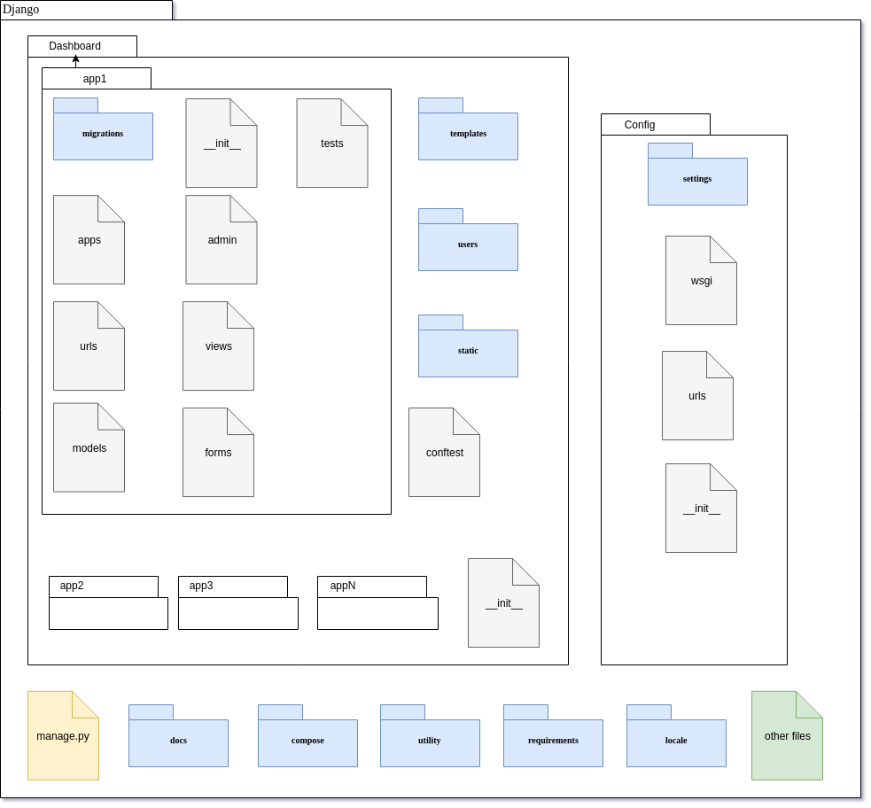
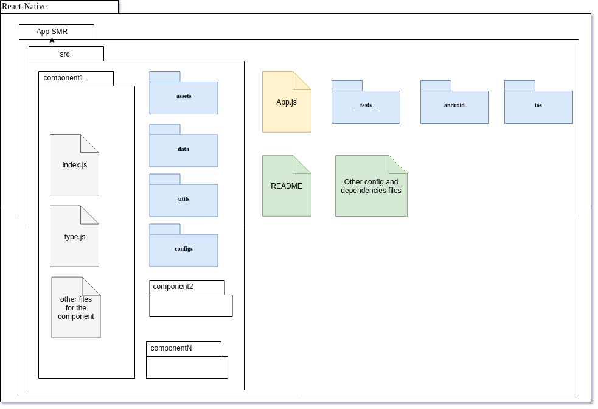

# Documento de Arquitetura

## Histórico de Revisão

|Data|Versão|Descrição|Autores|
|---|---|---|---|
|24/03/2019|0.0.0|Criação do documento e estrutura inicial|João Pedro Sconetto|
|25/03/2019|0.0.1|Adição da versão inicial do documento para revisão da equipe de software|João Pedro Sconetto|
|29/03/2019|0.1.0|Refinamento da primeira versão para apreciação|João Pedro Sconetto|

---

## 1: Introdução

### 1.1: Finalidade

Esta seção tem como finalidade apresentar uma visão geral arquitetural do sistemas que compõe a rede de serviços de software para o __*RaDop - Radar de Efeito Doppler*__, que será usada como guia no desenvolvimento do projeto e permitirá um entendimento maior de todos os componentes integrantes destes sistemas, como um todo, além de descrever comportamentos, padrões, protocolos de comunicação e demais informações relacionadas ou correlacionadas. Com o detalhamento da arquitetura, espera-se, também, deixar explicíta as decisões arquiteturais realizadas pela equipe.

### 1.2: Escopo

O documento presente abrange três camadas de produtos de software proposto pela equipe de Projeto Integrador 2 na UnB/FGA, sendo eles um servidor de serviços/microserviços que darão suporte ao Radar de Efeito Doppler, com serviços de manipulação de dados, processamento de imagens, tomada de decisões em tempo real, entre outros. A segunda se trata de um WebApp de Dashboard, onde estará centralizado grande parte dos dados providos do Radar com painéis de visualização em tempo real e alguns dados estatísticos do mesmo. E por fim, o último produto de software se trata de uma aplicação _mobile_ para auxílio de equipes de manutenção, com dados e informações sobre o equipamento.

### 1.3: Definições, Acrônimos e Abreviações

- __RaDop__: Nome comercial do Radar produzido pela equipe de Projeto Integrador 2.
- __UnB__: Universidade de Brasília
- __FGA__: Faculdade Gama
- __SMR__: Sistema de Monitoramento Remoto

## 2: Produtos de Software

### 2.1: Servidor de Microserviços RaDop - SMR

A solução de software proposta para o RaDop será composta de um servidor de serviços/microserviços para realizar tarefas específicas, esses serviços serão especialistas em tarefas que serão suportadas pelo RaDop, dessa forma haverá um sistema central que controlará os demais serviços. A comunicação se dará via API e requisições HTML com transporte, se necessário, de arquivos JSON com os dados para execução completa e correta dos serviços. Vale ressaltar que, para sistemas que comunicam diretamente com componentes eletrônicos do equipamento, o formato de comunicação pode ser diferente, mas mantendo-se em protocolos de comunicação em rede, o que pode alterar o formato de transporte de dados de JSON para um _encoding_ mais simples. Os serviços deverão ser construídos em [python](https://www.python.org/) e/ou em [Go](https://golang.org/), podendo ser atribuído a estes uso de _frameworks_/ferramentas/tecnologias a serem definidas no andamento do projeto e posteriormente descritos nesta seção. Detalhes da arquitetura dos mesmos também serão adicionados a posteriori.

### 2.2: WebApp Dashboard RaDop

O WebApp Dashboard RaDop será uma aplicação web desenvolvida a partir do _framework_ [Django](https://www.djangoproject.com/), o qual é escrito na linguagem de programação [python](https://www.python.org/). O _framework_ utiliza por definição o padrão arquitetural __MVT__, abreviação para _model_, _view_, _template_, que é derivada do padrão arquitetural __MVC__, _model_, _view_, _controller_, amplamente utilizada para esta finalidade e largamente aceita pela comunidade produtora de software. De acordo com o _site_ DjangoBook, a parte de _controller_, em Django, é tratada pelo próprio _framework_. Portanto a _View_ do __MVT__ desempenha um papel próximo, mas não igual ao _controller_.

As camadas desse tipo de arquitetura estão descritas no seguinte formato, abaixo.

#### 2.2.1: _Model_

É uma representação do banco de dados. Além disso, também inclui características, relações e outros comportamentos que os dados podem assumir.

O Django inclui varias ferramentas para automatizar tanto quanto possível o processo e a manipulação do banco de dados, de forma que o desenvolvedor não precise se preocupar tanto com o banco de dados, o que ajuda no foco do desenvolvimento da aplicação de forma mais rápida.

#### 2.2.2: _View_

Estabelece uma ponte entre a _Models_ e o _Templates_. Recebe as requisições do usuário a partir do _template_, acessa o banco de dados e então retorna a informação solicitada pelo usuário, por meio de HTML, XML e/ou os erros encontrados.

#### 2.2.3: _Template_

Agrega toda a parte visual que estará visível para os usuários. Inclui os códigos HTML, CSS, JavaScript, entre outras linguagens que são utilizadas na apresentação da _View_/_Front-end_ ao usuário.

### 2.3: Aplicativo RaDop

O aplicativo RaDop será uma aplicação mobile desenvolvida a partir do _framework_ React-Native (https://facebook.github.io/react-native/), construído em cima da linguagem de programação JavaScript (https://www.javascript.com/). O React-Native é o que chamamos de _data-driven_, ou seja, ele não implementa padrões arquiteturais por padrão, apenas utiliza os dados que recebe (basicamente as funções recebem os dados e devolvem resultados). No caso do React os dados são o estado da aplicação, as controllers são as funções são os componentes e os resultados são a UI. Dessa forma, a aplicação é modularizada em __N__ componentes (podendo ser _stateless_ ou _stateful_), o que torna a aplicação escalável, robusta e de fácil manutenção.

#### 2.3.1: _Stateless_

Neste formato de componente apenas recebe dados de outros componentes para a sua execução, isso infere que cada uma de suas execuções é independente, portanto não há conexão entre uma transação e outra. Com isso o componente não retém dados para si, ou estado de sessões, propriedades, execuções ou outras informações quaisquer em sua estrutura.

#### 2.3.2: _Statefull_

Neste formato o componente controla o seu próprio estado, ou seja, ele armazena informações de sua própria execução e subsequentemente, como o próprio nome diz, do seu estado. Com isso, também, o componente fica responsável pelo envio dessas informações para outros componentes.

## 3: Requisitos e Restrições Arquiteturais

### 3.1: Servidor de Microserviços RaDop - SMR

|Requisito|Ferramenta/Solução|
|---|---|
|Linguagem|Python 3.7.2 e Go 1.12|
|Framework|WebSocket, API Rest e outros|
|Segurança|Os dados utiizados nos serviços/microsserviços de apoio serão armazenados apenas para auditórias e uso em estatísticas/_mining_/_BI_, sendo possível o agendamento da remoção dos mesmos para manter sigilo de dados pessoais, caso necessário.|

### 3.2: WebApp Dashboard RaDop

|Requisito|Ferramenta/Solução|
|---|---|
|Linguagem|Python 3.7.2|
|Framework|Django 2.1.7|
|Plataforma|Web - Navegadores Google Chrome, Safari e Firefox|
|Segurança|Todas as informações dos usuários da dashboard devem ser tratadas em sigilo para que apenas o próprio usuário possa visualizá-las, demais informações não serão armazenadas a fim de manter sigilo de dados dos mesmos.|

### 3.3: Aplicativo RaDop

|Requisito|Ferramenta/Solução|
|---|---|
|Linguagem|JavaScript ES 6|
|Framework|React-Native 0.59|
|Dependências|Java Oracle JDK 8 e Node 11+|
|Plataforma|Mobile - Android 4+|

## 4: Visão Lógica

### 4.1: Serviços RaDop

A visão lógica dos serviços do RaDop serão melhor apresentados durante a execução do projeto devido ao fato da necessidade de cada serviço ser única não permitir apenas uma representação lógica dos mesmos.

### 4.2: WebApp Dashboard RaDop

### 4.3: Aplicativo RaDop

## 5: Tamanho e Desempenho

Devido a necessidade de decisões em tempo real os sistemas críticos deverão ser desenvolvidos de modo a serem o mais perfomáticos possível, num ponto de vista de tempo de execução, tempo de recebimento de dado e tempo de envio de dados (excluíndo de fatores externos), e que sejam capaz de se recuperar de falhas, sejam de redes, de execução e etc. Os demais sistemas que não forem críticos deverão seguir os melhores padrões da comunidade produtora de software, afim de manter o seu tamanho e desempenho dentro de parâmetros aceitáveis pelos _stakeholders_ do projeto.

## 6: Qualidade

A qualidade das três camadas de produto software para o Radar de Efeito Doppler - RaDop se darão pelos padrões definidos na comunidade, sendo avaliado legibilidade de código dado pelo padrão de estilo de escrita, como o [PEP 8](https://www.python.org/dev/peps/pep-0008/) definido pelo python, cobertura de código via testes unitários e presença de testes unitários para funções dos módulos dos sistemas/serviços. As interfaces visuais serão testadas para serem usáveis, interativas e de fácil aprendizado, sendo essas validadas com os _stakeholders_ do projeto e com os integrantes da equipe.

## Referências

[1] https://djangobook.com/mdj2-django-structure/. Acesso em 25 de março de 2019.
[2] https://github.com/DroidFoundry/DroidMetronome/wiki/Documento-de-Arquitetura-de-Software-(DAS). Acesso em 25 de março de 2019.
[3] https://docs.djangoproject.com/en/2.1/. Acesso em 25 de março de 2019.
[4] https://medium.com/@henriquejensen/arquitetura-de-projeto-react-e-redux-a1c24c1319d2. Acesso em 25 em março de 2019.
[5] https://pt.wikipedia.org/wiki/Protocolo_sem_estado. Acesso em 27 de março de 2019.